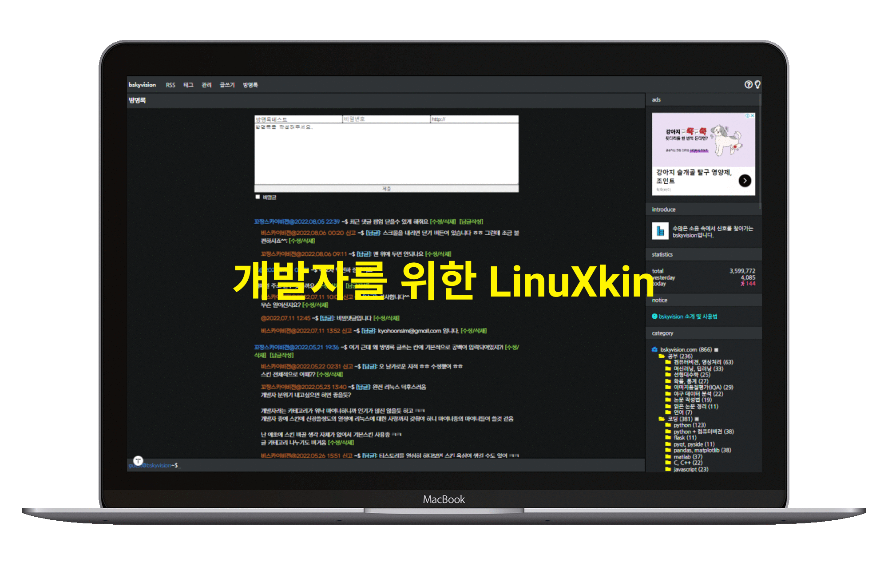

# LinuXkin

## 개발자를 위한 티스토리 반응형 스킨, 리눅스킨(LinuXkin)입니다.

- 스킨을 디자인할 때 리눅스와 구름 IDE의 UI에서 영감을 얻었습니다.  
- 티스토리 유저분들은 이 스킨을 마음껏 수정해서 사용하셔도 됩니다. 
- 단, 스킨의 배포는 이곳에서만 가능합니다. 
- 이 스킨을 다운받기 전에 우측 상단에 있는 별:star: 하나만 눌러주세요. :D
- 감사합니다.
- 리눅스킨에 대한 자세한 소개는 [링크](https://bskyvision.com/1075)를 참고하세요.

## 사용기술
- HTML, JavaScript, JQuery, CSS

## 티스토리 스킨 제작에 도움이 되는 웹페이지
* 티스토리 스킨 가이드: https://tistory.github.io/document-tistory-skin/

## 제작자 블로그
- 비스카이비전: https://bskyvision.com/ 
- 이메일: kyohoonsim@gmail.com 
